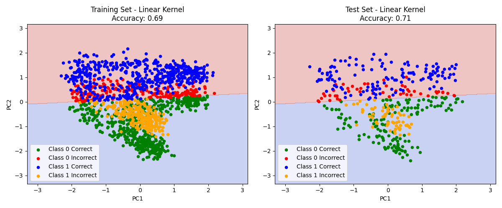

# 
Report of Classification Homework

*
Taoming Yang
* 
_
buaaytm@buaa.edu.cn
_

## 
_Abstract_

&emsp;&emsp;本报告研究了决策树、AdaBoost+Decision Tree和支持向量机（SVM）三种分类模型在 `CreatePoint` 数据集上的表现，并分析了主成分分析（PCA）降维的效果。结果显示，AdaBoost（迭代 9 次）、 SVM（高斯核）和决策树（深度 9）表现最为优异，实验和训练正确率均达到了95%以上，而线性核和 Sigmoid 核表现较差。此外，PCA 降维后准确率普遍下降，数学推导证明无噪声数据协方差矩阵特征值均为 1，无明显主成分，导致信息丢失，保留原始特征优于降维。

## 
_Introduction_
&emsp;&emsp;分类问题是机器学习中的核心任务，广泛应用于模式识别和数据分析。本报告基于 `CreatePoint` 数据集，探索了三种经典分类方法——决策树、AdaBoost（集成决策树）和支持向量机（SVM）的性能。这些方法通过不同策略（递归划分、集成学习、最大间隔超平面）实现分类，是课程学习的重要内容。实验中，我们考察了模型参数（如决策树深度、AdaBoost 迭代次数、SVM 核函数）对准确率的影响，并引入 PCA 降维以探究其在简化数据同时保留信息的能力。

## 
_Methodology_

&emsp;&emsp;本篇报告中我们使用了课程中教授给出的三种分类模型的方法，分别是：决策树(Decision Tree)、集成学习+决策树(Adaptive Boosting-Decision Tree)、支持向量机(Support Vector Machine)。在每种方法中，我们也对相关参数对分类结果影响进行了探究，如，在决策树中，我们探究了限定不同最大深度对训练准确率的影响；在Adaboost中，我们探究了迭代轮数对训练准确率的影响；在支持向量机中，我们探究了不同的核函数（Kernal Methods）对训练准确率的影响。后续我们的评价模型指标均为准确率\( Accuracy \)，因此我们先将函数表达式撰写如下：
$$Accuracy = \frac{模型预测正确样本数量}{样本总数}$$
&emsp;&emsp;值得一提的是，评价模型指标有很多，如召回率、精准率、F1分数、混淆矩阵、交叉熵损失，在本次作业中，我们进行的是一项简单的二分类任务，所以仅使用准确率作为评价指标。
&emsp;&emsp;各模型的具体实现如下。

### *M1: Decision Tree*

&emsp;&emsp;决策树是一种用于分类和回归的监督学习方法，通过树形结构对数据进行递归划分。
&emsp;&emsp;我们假设：
- **输入**：训练数据集 \( D = \{(x_1, y_1), (x_2, y_2), \dots, (x_n, y_n)\} \)，\( x_i \) 为特征向量，\( y_i \) 为标签。
- **输出**：一棵决策树，具体树结构为：
  * **根节点**：整个数据集 \( D \)。
  * **内部节点**：基于某一特征的划分条件。
  * **叶节点**：最终的预测结果（类别或数值）。
  * **分支**：特征取值的不同条件。
- **目标**：通过特征选择划分数据，使得最终的每一个叶节点只包含一类数据。

迭代方案如下：
1.划分依据：信息增益

我们用数据集 \( D \) 的信息熵来衡量其不确定性：
\[
H(D) = -\sum_{k=1}^K p_k \log_2 p_k
\]
- \( p_k \)：类别 \( k \) 的比例。
- \( K \)：类别数。

划分后的信息熵：
根据特征 \( A \) 划分后的条件熵：
\[
H(D|A) = \sum_{v=1}^V \frac{|D_v|}{|D|} H(D_v)
\]
- \( |D_v| \)：划分后第 \( v \) 的子集的数据数量。
- \(|D|\)：数据集\(D\)的数据总量。
- \( V \)：划分后子集总个数。

特征 \( A \) 的信息增益：
\[
\text{Gain}(D, A) = H(D) - H(D|A)
\]
- 最终，我们选择 \( \text{Gain}(D, A) \) 最大的特征进行划分。

2.递归构建
对每个节点：
  1. 若满足停止条件（如：纯度足够/样本数过少/达到设定的最大深度），设为叶节点。
  2. 否则，选择最优特征划分，生成子节点。

递归直到所有节点处理完毕。

3.预测
- 从根节点开始，根据特征条件沿分支向下。
- 到达叶节点，返回其值（分类任务：该节点占多数的数据类别；回归任务：该节点所有数据的均值）。

### *M2: Adaptive Boosting-Decision Tree*

&emsp;&emsp;AdaBoost 是一种**集成学习**（**Ensemble Learning**）方法，通过组合多个弱分类,构建强分类器，逐步调整样本权重以提升性能。初始时，所有样本权重相等，在每轮迭代中：
  - 训练一个弱分类器。
  - 增加误分类样本的权重，减少正确分类样本的权重。
  - 组合所有弱分类器，基于其性能加权。

模型假设如下：
- **输入**：训练数据集 \( D = \{(x_1, y_1), (x_2, y_2), \dots, (x_n, y_n)\} \)，\( x_i \) 为特征向量，\( y_i \in \{-1, 1\} \)（二分类标签）。
- **输出**：强分类器 \( H(x) \)。
- **目标**：通过迭代训练弱分类器，动态调整样本权重，减少整体误差。

算法步骤：

初始化每个**样本权重**：
\[
w_i^{(1)} = \frac{1}{n}, \quad i = 1, 2, \dots, n
\]

右上角的（1）代表迭代轮数：对于 \( t = 1, 2, \dots, T \)（\( T \) 为迭代次数）：
1. **训练弱分类器**：
   - 在权重分布 \( w^{(t)} \) 下，训练弱分类器 \( h_t(x) \)（如决策树），使其误差最小：
     \[
     e_t = \sum_{i=1}^n w_i^{(t)} I(h_t(x_i) \neq y_i)
     \]
     - \( I(\cdot) \)：指示函数，误分类为 1，否则为 0。
   - 要求 \( e_t < 0.5 \)（弱分类器优于随机猜测）。

2. **分配分类器权重**：
   - 弱分类器 \( h_t \) 的权重：
     \[
     \alpha_t = \frac{1}{2} \ln \left( \frac{1 - e_t}{e_t} \right)
     \]
   - \( \alpha_t \) 与误差反相关，\( e_t \) 越小，\( \alpha_t \) 越大。

3. **更新样本权重**：
   - 新权重：
     \[
     w_i^{(t+1)} = \frac{w_i^{(t)} e^{(-\alpha_t y_i h_t(x_i))}}{Z_t}
     \]
     - \( Z_t = \sum_{i=1}^n w_i^{(t)} e^{(-\alpha_t y_i h_t(x_i))} \)：归一化因子。
     - 可以简记为：
       - 如果该样本\(y^{(i)} = h_t(x_i)\),则\(w_i^{(t+1)} = w_i^{(t)} e^{-\alpha_t }\)
       - 如果该样本\(y^{(i)} \neq h_t(x_i)\),则\(w_i^{(t+1)} = w_i^{(t)} e^{\alpha_t }\)
   - 若 \( h_t(x_i) = y_i \)（正确），权重减小；若误分类，权重增加。

4. **用重新分配权重后的样本进行下一轮迭代**

5. **组合强分类器**：
   - 最终分类器：
     \[
     H(x) = \text{sign} \left( \sum_{t=1}^T \alpha_t h_t(x) \right)
     \]
     - \( \text{sign}(\cdot) \)：符号函数，根据正负返回 \( \pm 1 \)。

### *M3: Support Vector Machine*

&emsp;&emsp;支持向量机（SVM）是一种监督学习方法，用于分类和回归，通过寻找最大间隔超平面分割数据。SVM 的核心目标是找到一个超平面，使其与最近数据点的距离（间隔）最大化。对于数据集
 \( D = \{(x_1, y_1), (x_2, y_2), \dots, (x_n, y_n)\} \)，\( x_i \in \mathbb{R}^p \)，\( y_i \in \{-1, 1\} \)
 
超平面定义为：
\[
w^T x + b = 0
\]
- \( w \)：法向量，决定超平面方向。
- \( b \)：偏置，决定超平面位置。

**Linear SVM（线性核函数）**  
目标：最大化间隔 \( 2/\|w\| \)（两侧支持向量到超平面的距离和）。
约束条件：
\[
y_i (w^T x_i + b) \geq 1, \quad i = 1, 2, \dots, n
\]
优化问题：
\[
\min_{w, b} \frac{1}{2} \|w\|^2, \quad \text{s.t.} \quad y_i (w^T x_i + b) \geq 1
\]
使用拉格朗日乘子法，转换为对偶问题：
\[
L(w,b,\alpha) = \frac{1}{2} \|w\|^2 -  \sum_{i=1}^n \alpha_i |y_i (w^T x_i+b)-1|
\]
对\(b,w\)分别求偏导：
\[
\frac{\partial L}{\partial w} = 0 \Rightarrow  w = \sum_{i=1}^n \alpha_i y_i x_i 
\]
\[
\frac{\partial L}{\partial b} = 0 \Rightarrow  \sum_{i=1}^n \alpha_i y_i = 0
\]
使用Dual Form，将\(L\)变为关于\(\alpha\)的表达式
\[
L=\sum_{i=1}^n \alpha_i - \frac{1}{2} \sum_{i=1}^n \sum_{j=1}^n \alpha_i \alpha_j y_i y_j (x_i^T x_j)
\]
即求：
\[
\max_{\alpha} \sum_{i=1}^n \alpha_i - \frac{1}{2} \sum_{i=1}^n \sum_{j=1}^n \alpha_i \alpha_j y_i y_j (x_i^T x_j)
\]
- 约束：\( \alpha_i \geq 0 \)，\( \sum_{i=1}^n \alpha_i y_i = 0 \)。  
- 之所以叫*Linear SVM*,是因为\(\sum_{i=1}^n \sum_{j=1}^n \alpha_i \alpha_j y_i y_j (x_i^T x_j)\)中，\(x_i ,x_j\)的组合方式为线性点积。

**Other Kernal Methods（非线性 SVM）**  
对于非线性数据，通过核函数 \( K(x_i, x_j) \) 将数据映射到高维空间：
\[
\max_{\alpha} \sum_{i=1}^n \alpha_i - \frac{1}{2} \sum_{i=1}^n \sum_{j=1}^n \alpha_i \alpha_j y_i y_j K(x_i, x_j)
\]
- 常见核函数：
  - 线性核(Linear Kernel)：\( K(x_i, x_j) = x_i^T x_j \)
  - 高斯核（RBF Kernel）：\( K(x_i, x_j) = e^{(-\frac{\|x_i - x_j\|^2}{2\sigma^2})} \)
  - Sigmoid 核（Sigmoid Kernel）：\( K(x_i, x_j) = \tanh(\alpha x_i^T x_j + c) \)  
    - \( \alpha > 0 \)：斜率参数。
    - \( c \)：偏移常数。
  - 多项式核（Polynomial Kernel）：\( K(x_i, x_j) = (x_i^T x_j + c)^d \)  
    - \( c \geq 0 \)：常数偏移。
    - \( d \)：多项式次数。

最终分类器：
\[
f(x) = \text{sign} \left( \sum_{i=1}^n \alpha_i y_i K(x_i, x) + b \right)
\]

&emsp;&emsp;SVM 的预测依赖支持向量（\( \alpha_i > 0 \) 的样本），具有较强的泛化能力，但对参数 \( C \) 和核函数敏感。

### *Principal Component Analysis Research*
&emsp;&emsp;在这次实验之前，我们也学习了***主成分分析/PCA/Principal Component Analysis***的相关知识,因此在本次作业中，我还使用了该方法讲数据降维至二维平面，以便节省计算时间同时可以直观的绘制出分界线区分不同数据点。但是在程序运行后发现主成分不明显（特征值均相等且约为1），接着我用数学推导过程证明了这个结论。下面是详细过程。
&emsp;&emsp;PCA的基本原理如下：
&emsp;&emsp;主成分分析（PCA）是一种降维技术，通过线性变换将高维数据投影到低维空间，保留最大方差。假设数据集为 \( X \)（\( n \times p \) 矩阵，\( n \) 个样本，\( p \) 个特征）。我们希望降维后的 \( X_{\text{pca}} \)（\( n \times k \) 矩阵，\( k < p \)）。且该矩阵可以最大限度保留信息，所以就需要找到正交的主成分方向，使投影方差最大化。
&emsp;&emsp;主要步骤如下：

1. 数据标准化
先标准化数据：
\[
x_{\text{std-i}} = \frac{x_i - \mu}{\sigma}
\]
- \( \mu \)：该特征均值。
- \( \sigma \)：该特征标准差。
- 结果：\( X_{\text{std}} \) 均值为 0，方差为 1。

2. 协方差矩阵
计算标准化数据的协方差矩阵：
\[
\Sigma = \frac{1}{n-1} X_{\text{std}}^T X_{\text{std}}
\]
- \( \Sigma \)：\( p \times p \) 对称矩阵。
由于预先的标准化，因此有这样的性质：
- 对角线：\( \Sigma_{jj} = 1 \)。
- 非对角线：\( \Sigma_{ij} = \rho_{ij} \)（相关系数）。
3. 最大方差方向
假设我们投影到一个单位向量 \( w \)（\( \|w\| = 1 \)），则矩阵变为：
\[
z = X_{\text{std}} w
\]
投影后的方差：
\[
\text{var}(z) = w^T \Sigma w
\]
因此为了区分度更高，需要投影后方差尽可能的大，即：
\[
\max_w w^T \Sigma w, \quad \text{s.t.} \quad w^T w = 1
\]
也就是要求解下列式子：
\[
\Sigma w = \lambda w
\]
- \( w \)：特征向量。
- \( \lambda \)：特征值（投影方差）。找到其中最大的那一个。

4. 降维
假设我们通过计算已经得到下面结果：
- 主成分 \( w_1, w_2, \dots, w_p \)：\( \Sigma \) 的特征向量。
- 排序：\( \lambda_1 \geq \lambda_2 \geq \dots \geq \lambda_p \)。
- \( w_i \) 正交：\( w_i^T w_j = 0 \)（\( i \neq j \)）。
我们希望降到\(k\)维，则有：
投影矩阵：
\[
W = [w_1, w_2, \dots, w_k]
\]
降维结果：
\[
X_{\text{pca}} = X_{\text{std}} W
\]
- \( X_{\text{pca}} \)：\( n \times k \) 矩阵，即为降维后的数据集。

## 
*Experimental Studies*

&emsp;&emsp;本次实验使用的数据点均生成于于[CreatePoint.py](CreatePoint.py)文件,生成的数据为两段月牙，数据绘制为3D点状图，便于后期对照：

    
    
图1: 生成点概览

  

**决策树模型**

我们首先将设定不同最大深度限制所训练的模型效果进行对比，以便下一步用效果最好的最大深度限制参数探究训练准确率。对比如下：

    
    
图2: 决策树最大深度-训练误差

从图中可以看出，在最大深度约为9轮时训练效果最好，后续增加深度将会逐渐出现过拟合现象。我们使用最大深度为9进行模型训练，训练结果如下：
\[accuracy_{train} = 99.5625\% \quad accuracy_{test}= 95.5\%\]

  

    
    
图3: 决策树分类效果

  

可以看出，深度为9时决策树的分类效果非常良好。
# 

**集成学习Adaboost模型**

我们使用的弱分类器是方法一中使用的决策树模型，但是为了使得效果更为明显，我们令决策树只训练3轮。接下来还是首先将不同迭代轮数所训练的模型效果进行对比，以便下一步用效率最高的迭代轮数进行训练，探究训练准确率。对比如下：

  

    
    
图4: Adaboost迭代轮数-误差

  

从图中可以看出，在迭代约为9轮时训练效果最好，后续增加深度将会逐渐出现过拟合现象。我们使用9轮迭代进行模型训练，训练结果如下：
\[accuracy_{train} = 99.8125\% \quad accuracy_{test}= 96.25\%\]

  

    
    
图5: 9轮迭代Adaboost训练效果

  

可以看出，迭代9时决策树的分类效果非常良好。

# 
**SVM模型**
本实验分别使用线性核函数，多项式核函数，高斯核函数，Sigmoid核函数分别进行拟合
模型拟合效果如下：
1. Linear Kernel
\[accuracy_{train} = 66.9375\% \quad accuracy_{test}= 67.25\%\]

  

    
    
图6: SVM(Linear Kernel)训练效果

  

2. Polynomial Kernel

\[accuracy_{train} = 77.75\% \quad accuracy_{test}= 79.0\%\]

  

    
    
图7:SVM(Polynomial Kernel)训练效果

  

3. RBF Kernel

\[accuracy_{train} = 98.8125\% \quad accuracy_{test}= 97.5\%\]

  

    
    
图8: SVM(RBF Kernel)训练效果

  

4. Sigmoid Kernel

\[accuracy_{train} = 55.375\% \quad accuracy_{test}= 57\%\]

  

    
    
图9: SVM(Sigmoid Kernel)训练效果

  

#
**PCA降维方法不可行性探究**

下面我将通过数学推导证明PCA降维分析在本次实验是不可行的。
- 根据定义，如果数据点的协方差矩阵的各特征值相等，则表明数据点在各方向的区分度相同（方差相同），则没有明显主次成分，沿任意方向降维都会丢失相等程度的信息。因此只需证明**协方差矩阵的各特征值相等**
- **假设**：假定数据为程序[CreatePoint.py](CreatePoint.py)生成的**连续函数**且**没有添加任何噪声**。即数据点为集合\(A\)
$
A =(x,y,z)= \left\{
\begin{aligned}
(1.5cos(t),sin(t),sin(2t)) \quad t \in (0,2\pi) \\
(-1.5cos(t),sin(t)-1,-sin(2t)) \quad t \in (0,2\pi)
\end{aligned}
\right.
$
- **证明**：该数据标准化后所形成的协方差矩阵特征值均相同且为1
- **证明如下**：
  1. 求出标准化后各坐标的表达式
以y轴坐标为例
\[
E(y)=\frac{1}{4\pi}\int_0^{2\pi}\sin(t)dt+\frac{1}{4\pi}\int_0^{2\pi}(\sin(t)-1)dt = -0.5
\]
\[
E(y^2)= \frac{1}{4\pi}\int_0^{2\pi}\sin(t)^2dt+\frac{1}{4\pi}\int_0^{2\pi}(\sin(t)-1)^2dt = 1
\]
\[
Var(y)=E(y^2)-E(y)=1.5
\]
则所有数据y坐标均变换为
$
y'=\frac{2y+1}{\sqrt3}= \left\{
\begin{aligned}
\frac{2}{3}\sqrt3(\sin(t)+\frac{1}{2}) \quad t \in (0,2\pi) \quad 数据类型1 \\
\frac{2}{3}\sqrt3(\sin(t)-\frac{1}{2}) \quad t \in (0,2\pi) \quad 数据类型2
\end{aligned}
\right.
$
同理，可以计算x，z坐标标准化后的结果。
结果列在下方：
$
A'= \left\{
\begin{aligned}
（\sqrt2\cos(t),\frac{2}{3}\sqrt3(\sin(t)+\frac{1}{2}),\sqrt2\sin(2t)） \quad t \in (0,2\pi) \quad 数据类型1 \\
（-\sqrt2\cos(t),\frac{2}{3}\sqrt3(\sin(t)-\frac{1}{2},-\sqrt2\sin(2t)) \quad t \in (0,2\pi) \quad 数据类型2
\end{aligned}
\right.
$
  2. 求协方差矩阵
在标准化后，协方差矩阵表示如下：
\[
\Sigma = \frac{1}{n-1} X_{\text{std}}^T X_{\text{std}}
\]
\[
\Sigma = \begin{pmatrix}
1 & \rho_{12} & \rho_{13} \\
\rho_{12} & 1 & \rho_{23} \\
\rho_{13} & \rho_{23} & 1
\end{pmatrix}
\]
其中\(\rho_{xy}\)表示x和y之间的相关系数
欲证特征值均为1，只需证明：
\[
\Sigma = \begin{pmatrix}
1 & 0 & 0 \\
0 & 1 & 0 \\
0 & 0 & 1
\end{pmatrix}
\]
只需证明：
\[ \rho_{12}=\rho_{13}=\rho_{23}=0\]
下面以\(\rho_{12}\)为例进行证明
\[\rho_{12} = \frac{E(xy)-E(x)E(y)}{(Var(x)Var(y))^{\frac{1}{2}}}=E(xy) \]
\[E(xy)= \frac{1}{4\pi}\int_0^{2\pi}\sqrt2\cos(t)\frac{2}{3}\sqrt3(\sin(t)+\frac{1}{2})dt+ \\ \frac{1}{4\pi}\int_0^{2\pi}[-\sqrt2\cos(t)\frac{2}{3}\sqrt3(\sin(t)-\frac{1}{2})]dt \\ =0\]
同理，可证 \(\rho_{13}=\rho_{23}=0\)
得证！

因此，我们会发现，无论从任何方向降维，都会均等的损失约\(\frac{1}{3}\)的信息，导致训练效果不佳。

我也将主成分分析后的数据点用于了模型训练，得到了如下结果：

  

    
    
图10: 主成分分析后的平面图

  

用于决策树中：

  

    
    
图11: PCA后决策树误差与深度关系

  

  

    
    
图12: PCA后9最大深度训练效果

  

用于SVM中：
1. Linear Kernel

  

    
    
图13: PCA-SVM(Linear Kernel)训练效果

  

1. Polynomial Kernel

  

    
    
图14:PCA-SVM(Polynomial Kernel)训练效果

  

3. RBF Kernel

  

    
    
图15:PCA-SVM(RBF Kernel)训练效果

  

4. Sigmoid Kernel

  

    
    
图16:PVA-SVM(Sigmoid Kernel)训练效果

  

可以看出，主成分分析后，模型的训练正确率基本都比分析前有明显下降
# 
**四种方法训练结果的汇总和对比**

表1 不同模型训练和测试正确率

| 模型  | Train Accuracy |   Test Accuracy   | Train Accuracy(PCA) |   Test Accuracy(PCA)  |
| :---: | :------: | :------: | :------: | :------: |
|   Decision Tree |   99.5625%   | 95.5% | 90% | 85% |
|   Adaboost+Decision Tree(Depth 3)   |   99.8125%   | 96.25% |
|   SVM(Linear Kernel)   |   66.9375%   | 67.5% | 69% | 71% |
|   SVM(Polynomial Kernel)  |   77。75%   | 79% | 71% | 71% |
|   SVM(RBF Fernel)  |   98.8125%   | 97.5% | 84% | 83% |
|   SVM(Sigmoid Kernel)  |   55.375%   | 57% | 47% | 45%|

## 
*Conclusions*

&emsp;&emsp;本报告通过实验对比了决策树、AdaBoost（结合决策树）以及支持向量机（SVM）在分类任务中的表现，并探究了 PCA 降维对模型性能的影响。实验结果表明：  

&emsp;&emsp;**决策树**在最大深度为 9 时表现出色，训练准确率为 99.56%，测试准确率为 95.5%，显示出良好的分类能力，但深度过高易导致过拟合。  

&emsp;&emsp;**AdaBoost**通过集成深度为 3 的弱决策树，在 9 次迭代后达到最优性能，训练准确率为 99.81%，测试准确率为 96.25%，略优于单一决策树，表明集成学习有效提升了泛化能力。  

&emsp;&emsp;**SVM**的性能高度依赖核函数选择：高斯核（RBF）效果最佳，接近决策树和 AdaBoost。多项式核表现尚可，线性核和 Sigmoid 核表现较差，反映出数据非线性特性较强。

&emsp;&emsp;**PCA 降维的影响**：数学推导证明，在无噪声的连续 `CreatePoint` 数据中，标准化后协方差矩阵特征值均为 1，表明各方向方差相等，无明显主成分。实验验证了这一点，PCA 降维后所有模型准确率普遍下降，说明降维丢失了关键区分信息。

&emsp;&emsp;综上，对于本次非线性分布的 `CreatePoint` 数据集，AdaBoost 和 SVM（RBF 核）表现最佳，适合复杂分类任务。决策树性能接近但稍逊，线性核和 Sigmoid 核的 SVM 则不适用。PCA 降维在此场景下不可行，保留原始三维数据更有利于分类。

## 
References

