
# 
Report of Linear Model Homework

*
Taoming Yang
* 
_
buaaytm@buaa.edu.cn
_

## 
Abstract

本报告研究了三种线性回归和一种非线性回归模型在拟合给定数据集中的表现。我们首先实现了课程中介绍的三种线性回归方法：梯度下降法（Gradient Descent）、最小二乘法（Ordinary Least Squares）和牛顿法（Newton’s Method），并使用均方误差（MSE）损失函数评估其效果。由于线性模型的拟合结果不够理想（MSE较高），我们引入了一种改进的可以实现曲线拟合的模型——带高斯分布权重的KNN模型（Gaussian-Weighted KNN）。实验基于Excel文件中的训练和测试数据集，结果表明，线性模型的训练损失在0.613至0.653之间，测试损失在0.595至0.617之间，而高斯加权KNN模型显著优于线性模型，训练损失为0.179，测试损失为0.258。

## 
Introduction
线性回归是统计建模和机器学习中的基础方法，广泛应用于预测连续变量。在本次作业报告中，我们探索了三种经典线性回归方法——梯度下降法、最小二乘法和牛顿法在拟合Excel数据集中的表现。这些方法通过最小化损失函数来确定模型参数，是课程学习的核心内容。然而，初步实验表明，线性模型的拟合效果不佳，损失函数值较高。为此，我们引入了一种可实现曲线拟合的方法，即带高斯分布权重的KNN模型,希望可以提高优化效果。

## 
Methodology

本篇报告中我们首先使用了课程中教授的三种线性模型拟合的方法，分别是：梯度下降法(Gradient_Decent)、最小二乘法(Ordinary_LeastSquare)、牛顿法(Newton_Method)。在完成每一种的线性拟合后，仍然感觉拟合效果不够理想(损失函数\( L \)过大)，因此我们尝试新的拟合方法实现曲线拟合，根据后续课程学习，我们决定采用带有高斯分布权重的KNN模型(K_NearsetNeighbours)进行拟合。后续我们的检验指标均为损失函数\( L \)，因此我们先讲函数表达式撰写如下：
$$L = \frac{1}{n}\sum_{i=1}^{n}(y_{pred}-y)^2$$
各模型的具体实现如下。

### M1: Gradient_Decent

梯度下降法的核心思想是通过多轮调整，能够最小化损失函数。具体来说：我们在每一轮不断调整各个参数的值，使得损失函数的函数值对各个参数的偏导数不断趋于0，当偏导数都为0时，损失函数也就来到了最小值。
在每次迭代中，参数 \( \theta \) 的更新规则为：
$$\theta = \theta - \alpha \nabla L(\theta)$$
其中:
- \(\theta\)为所有参数形成的\(n \times 1\)的参数矩阵
- \( \alpha \)：学习率（learning rate），控制每次更新的步长。
- \( \nabla L(\theta) \)：损失函数 \( L(\theta) \) 对 \( \theta \) 的偏导数，也是一个\(n \times 1\)的参数矩阵。

对于线性拟合情况：我们设参数 \( \theta_0 \) 和 \( \theta_1 \)，使预测函数 \( y_{pred}(x) = \theta_0 + \theta_1 x \)
\( L(\theta) \)对 \( \theta_0 \) 的偏导数：
\[
\frac{\partial L}{\partial \theta_0} = \frac{1}{n} \sum_{i=1}^{n} (h_\theta(x^{(i)}) - y^{(i)})
\]

\( L(\theta) \)对 \( \theta_1 \) 的偏导数：
\[
\frac{\partial L}{\partial \theta_1} = \frac{1}{n} \sum_{i=1}^{n} (h_\theta(x^{(i)}) - y^{(i)}) x^{(i)}
\]
使用梯度下降更新参数，公式如下：

\[
\theta_0 = \theta_0 - \alpha \frac{\partial J}{\partial \theta_0}
\]

\[
\theta_1 = \theta_1 - \alpha \frac{\partial J}{\partial \theta_1}
\]
### M2: Ordinary_LeastSquare

假设有 \( n \) 个样本，输入特征矩阵 \( X \)（大小 \( n \times m \)），参数向量 \( \theta \)（大小 \( m \times 1 \)），真实值向量 \( y \)（大小 \( n \times 1 \)）。预测值为：

$$\hat{y} = X \theta$$
我们用几何方法进行求解：

在最小二乘法中，\( X \theta \) 是 \( X \) 形成的空间中的一个向量。那么误差向量 \( e = y - \hat{y} \) 是 \( y \) 与预测值\(\hat{y}\)的差。为了使 \( J(\theta) \) 最小，即\( e \)最短，则必须垂直于\(X\)形成的空间中的所有向量。

若 \( e \) 与 \( X \) 的每一列垂直，则 \( X \) 的每一列与 \( e \) 的点积为 0。即：

$$X^T (y - X \theta) = 0$$
其中：
- \( X^T \)：\( m \times n \) 矩阵。
- \( y - X \theta \)：\( n \times 1 \) 误差向量。
- \( X^T (y - X \theta) \)：\( m \times 1 \) 向量。

展开括号得
\[
X^T y - X^T X \theta = 0
\]
整理：
\[
X^T X \theta = X^T y
\]
解得
\[
\theta = (X^T X)^{-1} X^T y
\]

这就是最小二乘法的参数矩阵表达式。

### M3: Newton_Method

牛顿法是一种迭代求解 \( f(x) = 0 \) 根的方法，其核心基于几何思想：利用函数在当前点的切线与 x 轴交点作为下一次估计值。以下是推导过程。

我们假设 \( f(x) \) 是可微函数，我们从初始猜测 \( x_0 \) 开始，目标是找到 \( x^* \) 使得 \( f(x^*) = 0 \)。牛顿法通过在每一步构造切线，逐步逼近真实根。

在当前估计值 \( x_n \) 处，设：
- 函数值为 \( f(x_n) \)。
- 切线斜率为 \( f'(x_n) \)（一阶导数）。
- 切线通过点 \( (x_n, f(x_n)) \)。

则，在\( x_n \)处的切线方程为：

$$y = f(x_n) + f'(x_n) (x - x_n)$$

切线与 x 轴交点的 x 坐标即为 \( x_{n+1} \)。当 \( y = 0 \) 时：

$$f(x_n) + f'(x_n) (x_{n+1} - x_n) = 0 $$

\[
f'(x_n) (x_{n+1} - x_n) = -f(x_n)
\]

假设 \( f'(x_n) \neq 0 \)（切线不平行于 x 轴），两边除以 \( f'(x_n) \)：

\[
x_{n+1} - x_n = -\frac{f(x_n)}{f'(x_n)}
\]

\[
x_{n+1} = x_n - \frac{f(x_n)}{f'(x_n)}
\]
当\( f'(x_n) \rightarrow 0\)时，使用洛必达法则，则有：
$$x_{n+1} = x_n - \frac{f'(x_n)}{f''(x_n)}$$
这就是牛顿法的迭代公式。
在本次线性拟合问题中，我们令函数为我们的损失函数\(L(\theta_0，\theta_1)\)，每一轮用牛顿法同时更新\(\theta_0\)和\(\theta_1\)的数值，找到两者关于\(L(\theta_0，\theta_1)\)的零点,即为所求参数值。

### Gaussian_Weighted_Knn
该方法通过引入距离相关的权重改进传统 KNN 模型。高斯分布权重基于距离的平方指数衰减，使得距离较近的邻居对预测贡献更大。
对于一个测试样本 \( x \)，找到其 \( K \) 个最近邻居，根据邻居的距离 \( d(x, x_i) \) 分配权重 \( w_i \)，然后加权预测结果。权重的大小用高斯分布定义为：

\[
w_i = e^{-\frac{d(x, x_i)^2}{2\sigma^2}}
\]
其中：
- \( w_i \)：第 \( i \) 个邻居的权重。
- \( d(x, x_i) \)：\( x \) 与邻居 \( x_i \) 的距离（通常为欧几里得距离）。
- \( \sigma \)：高斯分布的标准差（带宽），控制权重衰减，可自己设定。

预测值 \( \hat{y} \) 为加权平均：

\[
\hat{y} = \frac{\sum_{i=1}^{K} w_i y_i}{\sum_{i=1}^{K} w_i}
\]

## 
Experimental Studies

本次实验使用的数据均来自于[这个excel表格中](Data4Regression.xlsx),其中，Sheet1为训练数据，Sheet2为测试数据。我们首先将两个Sheet中数据绘制为点状图，便于后期对照：

  

    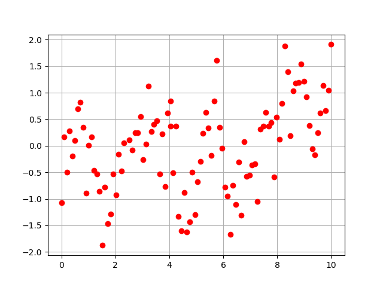
    
图1: 训练点图

  

  

    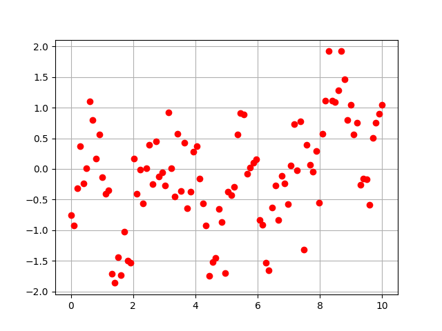
    
图2: 测试点图

  

**梯度下降模型**
经过多次测试发现：在100轮训练的情况下，最终拟合的参数值十份依赖初始点的选择。综合考虑测试与训练误差，我们令\(\theta_0=0,\theta_1=0\)作为初始情况进行训练
模型拟合效果如下：

  

    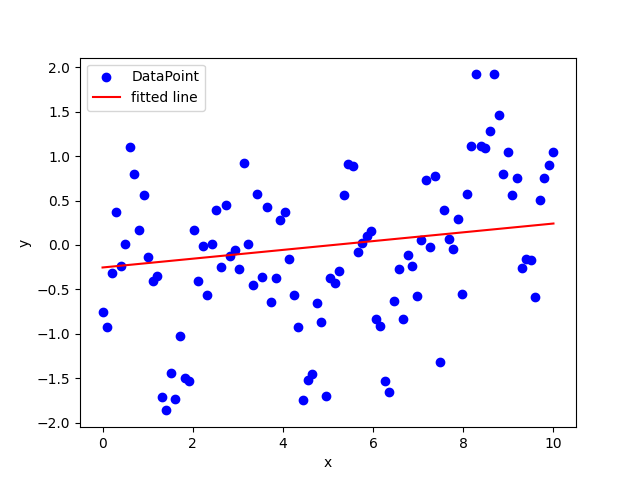
    
图3: 梯度下降的训练拟合

  

  

    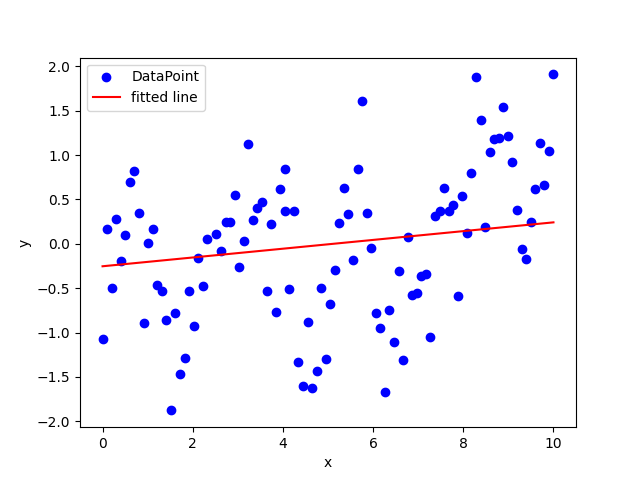
    
图4: 梯度下降的测试拟合

  

训练过程的损失函数变化情况：

  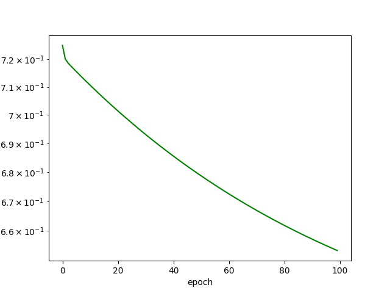
  
图5: 梯度下降训练损失变化

最终拟合的函数为：\( y = 0.049x+0.253\) 

**最小二乘法模型**
模型拟合效果如下：

  

    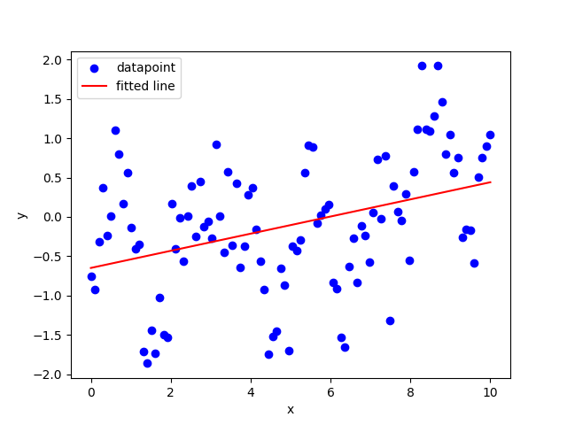
    
图6: 最小二乘法的训练拟合

  

  

    
    
图7: 最小二乘法的测试拟合

  

最终拟合的函数为：\( y = 0.109x-0.649\) 

**牛顿法模型**
模型拟合效果如下：

  

    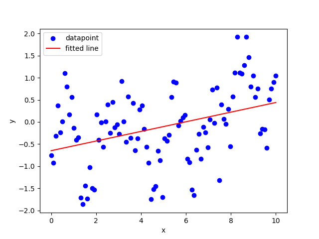
    
图8: 牛顿法的训练拟合

  

  

    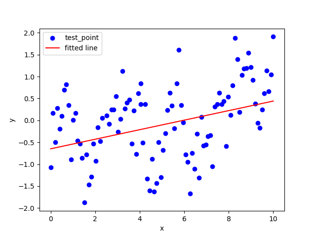
    
图9: 牛顿法的测试拟合

  

训练过程的损失函数变化情况：

    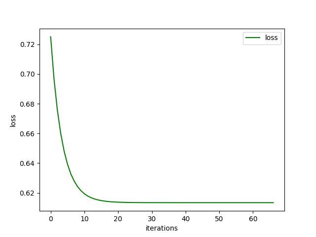
    
图10: 牛顿法训练损失变化

  

训练在67轮就已经结束。最终拟合的函数为：\( y = 0.109x-0.649\) 

**加权KNN模型**
经过多次测试，我们令\(K=5,\ sigma = 1\)进行拟合效果最好
模型拟合效果如下：

  

    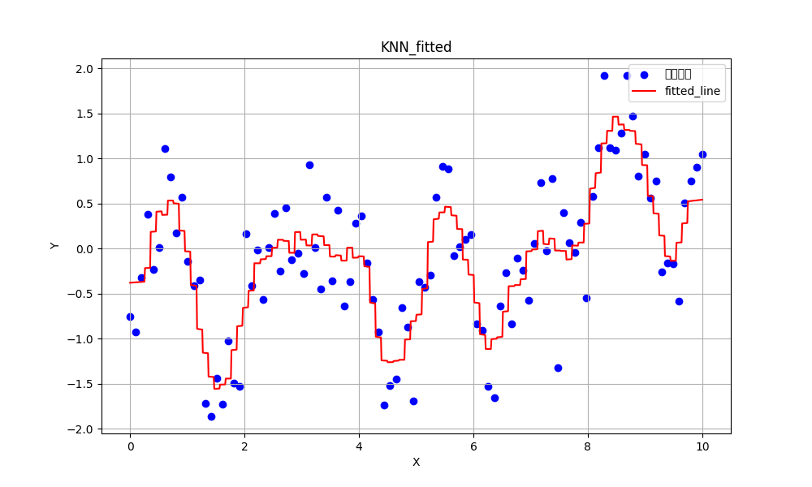
    
图11: 加权KNN的训练拟合

  

  

    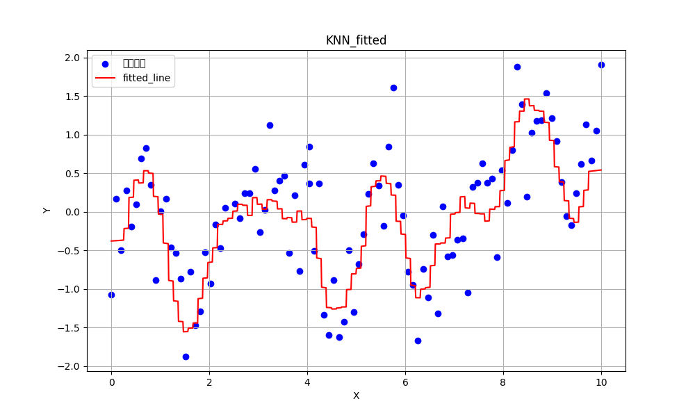
    
图12: 加权KNN的测试拟合

  

**四种方法拟合损失的汇总和对比**

表1 不同模型训练和测试损失

| 模型  | Train Loss |   Test Loss   |
| :---: | :------: | :------: |
|   M1(Gradient_Decent)  |   0.653   | 0.617 |
|   M2(Ordinary_LeastSquare)   |   0.613   | 0.595 |
|   M3(Newton_Method)   |   0.613   | 0.595 |
|   M4(Gaussian_Weighted_Knn)  |   0.179   | 0.258 |

## 
Conclusions

本研究通过实验对比了多种回归方法在给定数据集上的表现，揭示了线性与非线性模型的适用性差异。三种线性回归方法——梯度下降法、最小二乘法和牛顿法——在训练数据上的损失均大于0.6，测试数据上的损失也都保持在0.6左右。其中，梯度下降法实验表明梯度下降十分拟合依赖初始点和学习率的选择，学习率过大会导致拟合过程来回震荡无法达到最优，学习率过低可能会导致需要多轮学习，初始点不同会导致局部最优的情况。最小二乘法和牛顿法收敛于相同参数（\( y = 0.109x - 0.649 \)），但仍无法充分拟合数据的复杂性。相比之下，带高斯权重的KNN模型（\( K = 5, \sigma = 1 \)）取得了训练损失0.179和测试损失0.258的优异结果，证明了非线性方法在处理复杂非线性数据模式时的优势。

## 
References

