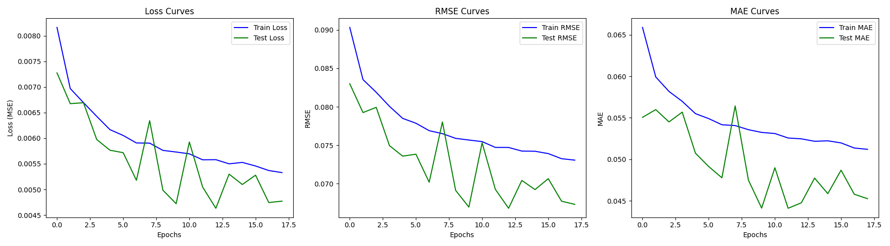

# 
Report of LSTM Homework

*
Taoming Yang
* 
_
buaaytm@buaa.edu.cn
_

## 
_Abstract_

&emsp;&emsp;本报告探讨了使用循环神经网络（RNN）和长短期记忆网络（LSTM）进行时间序列预测的应用，重点针对[Kaggle平台](https://www.kaggle.com)上的天气预测数据集进行模型构建与评估。实验采用双层单向 LSTM 架构，通过 PyTorch 框架实现，结合早停机制优化训练过程。评估指标包括均方误差（MSE）、均方根误差（RMSE）和平均绝对误差（MAE）。结果表明，模型在测试集上取得了优异的预测性能，MSE 达到 0.0046，预测误差控制在 ±5% 以内。本研究展示了 LSTM 在处理长期依赖序列数据中的强大能力，为时间序列预测任务提供了有效方法。

## 
_Introduction_
&emsp;&emsp;时间序列预测是机器学习领域的重要研究方向，广泛应用于天气预测、污染指数监测等场景。传统方法如 ARIMA 在捕捉复杂非线性关系时存在局限性，而深度学习模型，尤其是循环神经网络（RNN）及其改进版本长短期记忆网络（LSTM），因其在序列建模中的优越性能而受到广泛关注。RNN 通过隐藏状态传递信息，适用于序列数据，但受限于梯度消失问题，难以处理长期依赖。LSTM 通过引入记忆单元和门机制，有效克服了这一问题，适合建模长时间跨度的序列数据。
&emsp;&emsp;本报告基于[Kaggle平台](https://www.kaggle.com)的天气预测数据集，构建并评估了一个基于双层 LSTM 的预测模型。实验使用 PyTorch 框架，结合数据预处理、模型训练和性能评估，验证 LSTM 在回归任务中的有效性。本文的主要工作包括：(1) 实现了高效的 LSTM 模型架构；(2) 有效的数据预处理和批量加载; (3) 通过 MSE、RMSE 和 MAE 评估模型性能。

## 
_Methodology_

&emsp;&emsp;本篇报告中我们使用了课程中教授介绍的RNN+LSTM的方法。同时我们使用了[Kaggle平台](https://www.kaggle.com)上面的[天气预测数据集]()进行了对模型的搭建和评估。
&emsp;&emsp;值得一提的是，本次任务是一个回归任务，因此我们使用新的评价指标：均方误差（MSE）、均方根误差（RMSE）和平均绝对误差（MAE）。它们的具体公式如下：
\[MSE=\frac{1}{n}\sum_{i=1}^{n}(\hat{y_i}-y_i)^2\]
\[RMSE=\sqrt{\frac{1}{n}\sum_{i=1}^{n}(\hat{y_i}-y_i)^2}\]
\[MAE=\frac{1}{n}\lvert\hat{y_i}-y_i\rvert\]
&emsp;&emsp;下面介绍RNN+LSTM具体实现模型训练的原理。

### 循环神经网络（RNN）
&emsp;&emsp;RNN 设计用于处理序列数据，通过维护一个“隐藏状态”来捕捉前序时间步的信息。在每个时间步 \( t \)，网络处理当前输入 \( x_t \) 和前一隐藏状态 \( h_{t-1} \)，生成新的隐藏状态 \( h_t \) 和可选的输出 \( y_t \)。

 **核心公式**：
- 隐藏状态更新：
 \[
  h_t = \sigma(W_{xh}x_t + W_{hh}h_{t-1} + b_h)
 \]
- 输出（若适用）：
 \[
 y_t = W_{hy}h_t + b_y
 \]
 其中：
- \( x_t \)：时间步 \( t \) 的输入。

- \( h_t \)：时间步 \( t \) 的隐藏状态。

- \( W_{xh}, W_{hh}, W_{hy} \)：输入到隐藏、隐藏到隐藏、隐藏到输出的权重矩阵。

- \( b_h, b_y \)：偏置项。

- \( \sigma \)：激活函数（引入非线性）。

**图片描述**：

  

    
    
图1: RNN结构图

  

 **局限性**：RNN 存在梯度消失或爆炸问题，难以学习序列中的长期依赖。于是我们引入LSTM：

### 长短期记忆网络（LSTM）
&emsp;&emsp;LSTM 是 RNN 的改进版本，旨在有效建模长期依赖。它引入了记忆单元 \( c_t \) 和三个门（遗忘门、输入门和输出门）来控制信息流，缓解梯度消失问题。

**核心公式**：
- 遗忘门（决定丢弃哪些信息）：
\[
  f_t = \sigma(W_{xf}x_t + W_{hf}h_{t-1} + b_f)
\]
- 输入门（决定存储哪些新信息）：
  \[
  i_t = \sigma(W_{xi}x_t + W_{hi}h_{t-1} + b_i)
  \]
- 候选记忆单元：
  \[
  \tilde{c}_t = \tanh(W_{xc}x_t + W_{hc}h_{t-1} + b_c)
  \]
- 记忆单元更新：
\[c_t = f_t \odot c_{t-1} + i_t \odot \tilde{c}_t\]
- 输出门（决定输出哪些信息）：
  \[
  o_t = \sigma(W_{xo}x_t + W_{ho}h_{t-1} + b_o)
  \]
- 隐藏状态（输出）：
  \[h_t = o_t \odot \tanh(c_t)\]
其中：
- \( x_t \)：时间步 \( t \) 的输入。
- \( h_t \)：时间步 \( t \) 的隐藏状态。
- \( c_t \)：时间步 \( t \) 的记忆单元状态。
- \( f_t, i_t, o_t \)：遗忘门、输入门和输出门。
- \( \sigma \)：Sigmoid 激活函数（\( \sigma(x) = \frac{1}{1 + e^{-x}} \)）。
- \( \tanh \)：双曲正切激活函数。
- \( \odot \)：逐元素乘法。
- \( W_{*}, b_{*} \)：各门的权重矩阵和偏置。

**图片描述**：

  

    
    
图2: LSTM结构图

  

&emsp;&emsp;因此，LSTM 能够捕捉长期依赖，适用于时间序列预测和自然语言处理等任务。

## 
*Experimental Studies*

&emsp;&emsp;本次实验使用的数据中，训练集来自于[LSTM-Multivariate_pollution.csv](LSTM-Multivariate_pollution.csv)文件,测试集合均来自于[pollution_test_data1.csv.xls](pollution_test_data1.csv.xls)文件。深度学习架构使用Pytorch架构实现。实现过程主要有以下关键点。

**数据预处理和批量加载**
&emsp;&emsp;Pytorch架构提供的数据需要是张量形式，但是csv文件中的数据含有字符串且为dataFrame形式，因此需要进行如下图所示的以下步骤：

  

    
    
图3: 数据处理流程图

  

**模型框架**

&emsp;&emsp;我们使用的是双层单向LSTM网络，在训练后，留下最后一个隐藏层数据，经过全连接层后输出预测值。
&emsp;&emsp;模型框架图如下：

  

    
    
图4: 网络模型框架结构

  

**训练结构**

&emsp;&emsp;在训练中，我们采用了早停机制（Early Stopping），在迭代约为18轮后达到最优训练停止，我们记录了每一轮各个损失函数的变化，训练结果如下：
\[MSE_{test} =0.0046 \quad RMSE_{test}= 0.0668 \quad MAE_{test} =0.04476 \]

  

    
    
图5: 每一轮损失变化

  

&emsp;&emsp;可以看出，训练效果非常良好，可保证预测污染指数在真实污染指数的\(\pm5\%\)之内。

## 
*Conclusions*

&emsp;&emsp;本研究成功验证了 LSTM 模型在时间序列预测任务中的优越性能。通过对天气预测数据集的实验，基于 PyTorch 的双层单向 LSTM 模型在 18 轮训练后达到最优，测试集上的 MSE 为 0.0046，RMSE 为 0.0668，MAE 为 0.04476，预测误差控制在 ±5% 以内。实验结果表明，LSTM 能够有效捕捉数据中的长期依赖关系，相较于传统 RNN 具有显著优势。数据预处理和早停机制的引入进一步提升了模型的鲁棒性和训练效率。未来工作可探索更复杂的模型架构（如双向 LSTM 或 Transformer）以及多变量输入，以进一步提高预测精度。

## 
References
